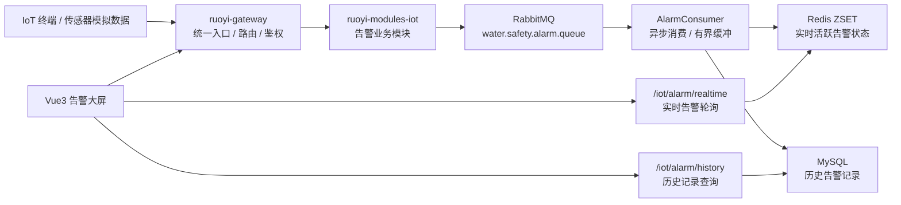

# RuoYi-Cloud IoT Safety Platform

基于 RuoYi-Cloud 的物联网水域安全监控与告警系统。项目面向泳池、海滨浴场、渔业水域等人员安全场景，围绕“设备上报 -> 消息削峰 -> 实时告警 -> 历史记录 -> 可视化大屏 -> 容器化部署”构建一条完整的 Java 微服务工程链路。

> 这是一个用于展示 Java 后端、Spring Cloud 微服务、物联网数据链路、消息队列、缓存、数据库索引和 Docker 部署能力的工程实践项目。默认以模拟终端数据和本地容器环境进行验证，重点展示架构设计、接口实现、联调排查和工程化交付能力。

## 项目定位

这个项目不是普通 CRUD 练习，而是一个贴近企业现场实施与后端开发的物联网告警平台：

- 业务上：覆盖水域安全监控、终端数据上报、实时告警、历史查询、监控大屏等场景。
- 后端上：基于 RuoYi-Cloud / Spring Cloud Alibaba 拆分网关、认证、系统管理、IoT 业务模块。
- 数据上：使用 RabbitMQ 承接突发告警报文，Redis 保存实时告警状态，MySQL 保存历史记录。
- 运维上：使用 Docker Compose 编排 Nacos、MySQL、Redis、RabbitMQ、Gateway、Auth、System、IoT 模块。
- 展示上：使用 Vue3 + Vite 构建告警监控大屏，支持在线轮询和模拟告警验证。

## 技术栈

| 分类 | 技术 |
| --- | --- |
| 后端框架 | Java 17, Spring Boot, Spring Cloud Alibaba, RuoYi-Cloud, MyBatis |
| 服务治理 | Nacos, Spring Cloud Gateway, Feign |
| 消息与缓存 | RabbitMQ, Redis ZSET |
| 数据库 | MySQL, B+ 树索引, 批量写入, 时间范围查询 |
| 前端展示 | Vue3, Vite, Element Plus |
| 工程部署 | Docker, Docker Compose, Linux/WSL2, Kubernetes HPA 配置示例 |
| 协作能力 | REST API, 日志排查, 接口联调, 部署文档, 问题闭环 |

## 系统架构



## 核心能力展示

### 1. 物联网告警数据链路

IoT 模块围绕设备告警数据设计了完整处理链路：

1. 终端数据以 JSON 报文进入告警队列。
2. RabbitMQ 解耦数据接收和业务处理，避免请求端直接写库。
3. 消费端解析告警报文，将实时告警状态写入 Redis。
4. 历史数据通过内存缓冲队列定时批量写入 MySQL。
5. 前端大屏轮询实时告警接口，展示终端状态和告警变化。

关键代码：

- [`AlarmConsumer.java`](ruoyi-modules/ruoyi-iot/src/main/java/com/ruoyi/iot/mq/AlarmConsumer.java)：RabbitMQ 消费、手动 ACK、Redis 状态写入、批量入库缓冲。
- [`SysDeviceAlarmDataController.java`](ruoyi-modules/ruoyi-iot/src/main/java/com/ruoyi/iot/controller/SysDeviceAlarmDataController.java)：实时告警接口与历史查询接口。
- [`SysDeviceAlarmDataMapper.xml`](ruoyi-modules/ruoyi-iot/src/main/resources/mapper/iot/SysDeviceAlarmDataMapper.xml)：批量写入与时间范围查询 SQL。

### 2. RabbitMQ 异步削峰与批量持久化

针对设备报文突发上报可能造成的数据库瞬时写入压力，项目采用 RabbitMQ + 内存有界队列 + 定时批量写入的组合：

- RabbitMQ 负责消息缓冲和消费解耦。
- `LinkedBlockingQueue` 限制内存缓冲上限，避免无限堆积。
- `@Scheduled(fixedRate = 5000)` 周期性 `drainTo` 批量取出数据。
- MyBatis 批量插入降低频繁单条写库带来的连接和 I/O 压力。
- RabbitMQ 手动 ACK 确保“业务处理完成后再确认消息”。

这部分能力能体现：消息队列、异步处理、批量写入、异常回滚、日志排查和系统稳定性思维。

### 3. Redis ZSET 实时告警状态

实时告警大屏只关心“当前仍处于活跃状态的设备”。项目使用 Redis ZSET 存储设备编码和过期时间戳：

- `member`：设备编码。
- `score`：告警过期时间戳。
- 查询前通过 `removeRangeByScore` 清理过期告警。
- 通过 `rangeByScore` 获取当前仍有效的活跃告警设备。

相比使用 `KEYS` 模糊搜索，这种方式更适合高频轮询场景，也能体现 Redis 数据结构选择能力。

### 4. MySQL 索引与查询规范

告警历史表围绕设备编码和上报时间建立索引：

```sql
KEY idx_device_time (device_code, report_time),
KEY idx_status (status)
```

历史查询 SQL 保持 `report_time >= #{beginTime}` 和 `report_time <= #{endTime}` 的纯范围比较，避免在索引列上套用 `DATE()` / `FORMAT()` 等函数，降低索引失效风险。

相关文件：

- [`db/sys_device_alarm_data.sql`](db/sys_device_alarm_data.sql)
- [`SysDeviceAlarmDataMapper.xml`](ruoyi-modules/ruoyi-iot/src/main/resources/mapper/iot/SysDeviceAlarmDataMapper.xml)

### 5. Docker Compose 本地联调环境

仓库提供 Compose 配置，用于拉起本地联调所需基础服务和业务模块：

- Nacos：服务注册与配置中心。
- MySQL：业务数据与告警历史记录。
- Redis：实时告警状态缓存。
- RabbitMQ：IoT 报文消息队列。
- Gateway / Auth / System / IoT：RuoYi-Cloud 微服务模块。

相关文件：

- [`docker-compose.yml`](docker-compose.yml)
- [`ruoyi-modules/ruoyi-iot/Dockerfile`](ruoyi-modules/ruoyi-iot/Dockerfile)
- [`k8s-hpa.yaml`](k8s-hpa.yaml)

## 模块说明

| 模块 | 端口 | 职责 |
| --- | --- | --- |
| `ruoyi-gateway` | 8080 | API 网关、统一入口、路由转发、鉴权过滤 |
| `ruoyi-auth` | 9200 | 登录认证、Token 签发与校验 |
| `ruoyi-modules-system` | 9201 | 用户、角色、菜单、权限等系统管理能力 |
| `ruoyi-modules-iot` | 9800 | 水域告警数据接入、实时状态、历史查询、队列消费 |
| `ruoyi-ui-vue3` | - | IoT 告警监控大屏页面 |

## 快速开始

### 环境要求

- JDK 17
- Maven 3.8+
- Node.js / pnpm 或 npm
- Docker Desktop 或 Docker Engine
- MySQL 8.0、Redis、RabbitMQ、Nacos 可通过 Docker Compose 拉起

### 1. 克隆项目

```bash
git clone https://github.com/thisisfrankryan/ruoyi-cloud-iot-safety.git
cd ruoyi-cloud-iot-safety
```

### 2. 启动基础服务

```bash
docker compose up -d ruoyi-mysql ruoyi-redis ruoyi-rabbitmq ruoyi-nacos
```

RabbitMQ 管理后台：

```text
http://localhost:15672
账号/密码：guest / guest
```

Nacos 控制台：

```text
http://localhost:8848/nacos
```

### 3. 构建后端模块

```bash
mvn clean package -DskipTests
```

### 4. 启动微服务

本地开发可以分别启动：

- `ruoyi-auth`
- `ruoyi-gateway`
- `ruoyi-modules-system`
- `ruoyi-modules-iot`

也可以使用 Compose 构建业务镜像后统一启动：

```bash
docker compose up -d --build
```

### 5. 访问告警大屏

前端页面位于：

```text
ruoyi-ui-vue3/src/views/iot/alarm/index.vue
```

页面支持在线轮询后端实时告警接口；在后端或硬件数据不可用时，也可以通过模拟告警按钮验证可视化效果。

## API 示例

### 实时活跃告警

```http
GET /iot/alarm/realtime
```

返回示例：

```json
{
  "code": 200,
  "data": {
    "TERM-POOL-A1": "1"
  }
}
```

### 历史告警记录

```http
GET /iot/alarm/history?deviceCode=TERM-POOL-A1&beginTime=2026-06-01T00:00:00&endTime=2026-06-02T00:00:00
```

## 为什么这个项目适合展示给企业

这个仓库集中展示了初中级 Java 开发、运维开发、物联网实施工程师岗位常见的核心能力：

- 能读懂并二开大型开源微服务框架，而不是只写孤立 Demo。
- 能围绕真实业务场景拆分接口、队列、缓存、数据库和前端展示。
- 能用 RabbitMQ / Redis / MySQL 处理“实时状态 + 历史记录”的数据分层。
- 能写 Dockerfile / Docker Compose，完成基础服务和业务模块联调。
- 能从日志、端口、容器、队列、缓存、数据库几个层面定位问题。
- 能把技术实现写成文档，便于团队交接、面试讲解和项目复盘。

## 面试讲解建议

如果面试官问这个项目，可以按下面顺序讲：

1. 业务场景：水域安全监控，需要设备上报、实时告警、历史查询和大屏展示。
2. 架构设计：RuoYi-Cloud 微服务底座，IoT 模块负责告警业务。
3. 数据链路：RabbitMQ 做异步削峰，Redis 保存实时告警，MySQL 保存历史数据。
4. 工程化：Docker Compose 拉起基础服务，Nacos 管理服务注册与配置。
5. 排查能力：通过日志、队列、Redis、MySQL 和接口返回定位链路问题。
6. 可改进点：可以继续补充设备接入协议、压测报告、接口鉴权、幂等处理和告警通知。

## 后续可扩展方向

- 接入 MQTT / WebSocket，实现更贴近真实 IoT 设备的数据接入。
- 增加告警通知：短信、邮件、企业微信或钉钉机器人。
- 增加接口压测报告，量化 RabbitMQ + 批量写入的吞吐效果。
- 增加 Prometheus + Grafana 监控服务运行状态和队列堆积情况。
- 增加设备管理、区域管理、告警等级、处理工单和用户通知闭环。

## License

本项目基于 MIT License 开源。RuoYi-Cloud 原框架版权归原作者及社区所有，本仓库用于个人工程实践、学习展示与求职作品集展示。
